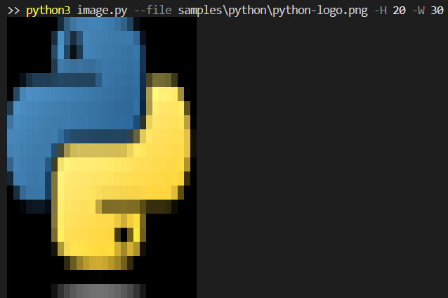
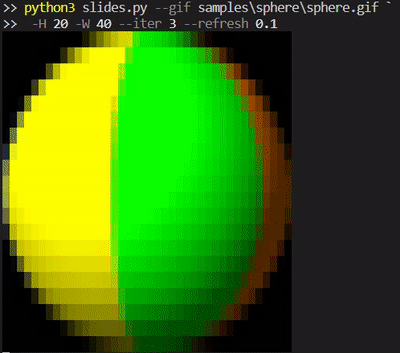
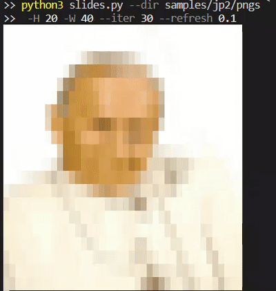

# Overview

The repository contains simple tools which can be used to display images and gifs in the terminal. It uses 24-bit ANSI escape sequences for colouring background https://en.wikipedia.org/wiki/ANSI_escape_code#8-bit.

# Requirements

The scripts should run on most operating systems. So far tested on Windows 11, Ubuntu 22.04, Centos 7.

Your terminal has to support 8-bit RGB colouring. Terminals font will impact the output as an image pixel will have height and width based on the font.

A recent version of python is needed, python 3.10.11 is recommended.

Your python environment has to have necessary libraries. The can be obtained with:
```
pip install -r requirements.txt
```

# Usage

## Display single image

Displaying a single image is possible by executing `image.py`. Formats `.png`, `.jpg` and `PPM P3` are supported.
```
$ python3 image.py --help  
usage: image.py [-h] [-H H] [-W W] --file FILE

options:
  -h, --help   show this help message and exit
  -H H         image height in pixels
  -W W         image width in pixels
  --file FILE  file path to image, supported formats .jpg .png
  ```
### Example:
```
python3 image.py --file samples\python\python-logo.png -H 20 -W 30
```



## Display gif or slides of images

Displaying a gif is done by executing `slides.py`.
```
>> python3 slides.py --help
usage: slides.py [-h] [-H H] [-W W] [--iter ITER] [--refresh REFRESH] (--dir DIR | --gif GIF)

options:
  -h, --help            show this help message and exit
  -H H                  image height in pixels
  -W W                  image width in pixels
  --iter ITER, -i ITER  number of iterations
  --refresh REFRESH, -r REFRESH
                        seconds per slide
  --dir DIR             path to directory with images
  --gif GIF             path to .gif file
```
The gif is chosen by either providing `--gif /path/to/gif/file` or `--dir /path/to/dir`. The `/path/to/dir` has to contain `.jpg` or `.png` images which will be ordered alphabetically.

### Example 1

```
python3 slides.py --gif samples/sphere/sphere.gif -H 20 -W 40 --iter 3 --refresh 0.1
```



### Example 2

```
python3 slides.py --dir samples/jp2/pngs -H 20 -W 40 --iter 3 --refresh 0.1
```


